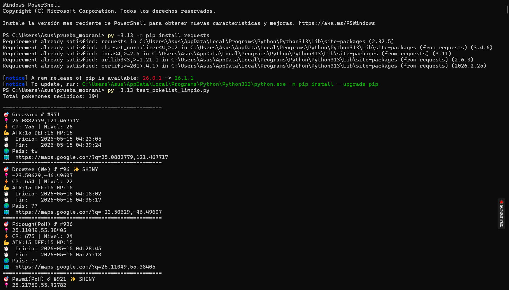
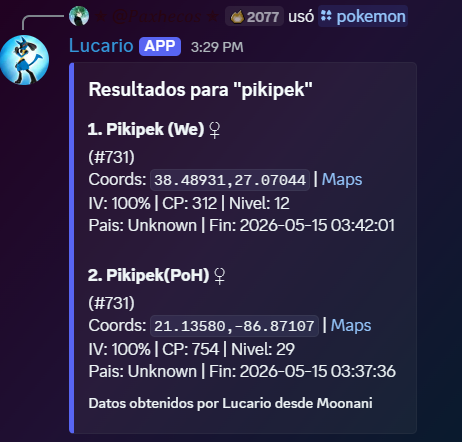
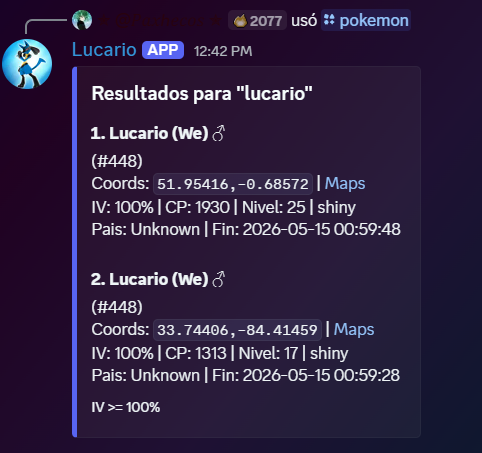

# Lucario - Moonani Discord Pokemon Coordinates Bot

Bot de Discord en Python que consulta el endpoint de Moonani PokeList para obtener apariciones de Pokemon iv100, extrae coordenadas y las publica en Discord mediante comandos.

## Que hace este proyecto. ¿A que quiero llegar?

- Consulta el endpoint `https://moonani.com/PokeList/ajax.php?page=pokemon&action=load`
- Limpia el HTML que devuelve Moonani en campos como nombre, IV, coordenadas y pais
- Extrae coordenadas listas para copiar y pegar, además de link redirigido a google maps.
- Permite buscar por nombre parcial
- De momento solo filtra los pokemones iv100
- Responde en Discord con mensajes compactos

## Estructura del proyecto

- `discord_bot.py`: punto de entrada del bot y definicion de comandos
- `moonani_client.py`: cliente HTTP y logica de parseo/filtrado de resultados
- `test_pokelist_limpio.py`: script base limpio usado para validar la idea original
- `.env`: variables de entorno (No compartir estos datos con terceros)
- `requirements.txt`: dependencias del proyecto

## Comandos disponibles

- `/ping`: verifica si el bot esta en linea
- `/pokemon`: muestra resultados con formato enriquecido
- `/coords`: devuelve coordenadas en formato compacto para copiar

## Requisitos

- Python 3.13 recomendado
- Un bot creado en el [Discord Developer Portal](https://discord.com/developers/applications)

## Prueba de funcionamiento breve

Antes de usar el bot de Discord, es posible validar desde cero la extraccion y el parseo de datos del endpoint de Moonani con un script independiente. Esta prueba no requiere clonar el repositorio completo ni configurar Discord.

### 1. Crear una carpeta de trabajo

```powershell
mkdir prueba_moonani
cd prueba_moonani
```
### 2. Crear el archivo test_pokelist_limpio.py
Crea un archivo llamado test_pokelist_limpio.py con este contenido:

```python
import requests
import re
import html

def extraer_coords(texto):
    match = re.search(r'data-clipboard-text="([^"]+)"', texto)
    return match.group(1) if match else ""

def limpiar_nombre(texto):
    # Primero decodifica entidades HTML (&#9792; -> ♀, &#9794; -> ♂)
    texto = html.unescape(texto)
    # Luego elimina las etiquetas HTML
    texto = re.sub(r'<[^>]+>', '', texto)
    # Limpia espacios extra
    return texto.strip()

def extraer_pais(texto):
    texto = html.unescape(texto)
    texto = re.sub(r'<[^>]+>', '', texto).strip()
    return texto if texto else "??"

url = "https://moonani.com/PokeList/ajax.php?page=pokemon&action=load"
payload = {
    "iv": 100,
    "pvp": 0,
    "pokemons": "",
    "start": 0,
    "length": 230,
    "draw": 1
}
headers = {
    "Referer": "https://moonani.com/PokeList/index.php",
    "Content-Type": "application/x-www-form-urlencoded"
}

r = requests.post(url, data=payload, headers=headers)
data = r.json().get("data", [])

print(f"Total pokémones recibidos: {len(data)}\n")

for p in data:
    nombre = limpiar_nombre(p["Name"])
    coords = extraer_coords(p["Coords"])
    shiny  = "✨ SHINY" if p["Shiny"] == "Yes" else ""
    pais   = extraer_pais(p["Country"])

    print(f"{'='*50}")
    print(f"🎯 {nombre} #{p['Number']} {shiny}")
    print(f"📍 {coords}")
    print(f"⚡ CP: {p['CP']} | Nivel: {p['Level']}")
    print(f"💪 ATK:{p['Attack']} DEF:{p['Defense']} HP:{p['HP']}")
    print(f"⏱️  Inicio: {p['Start Time']}")
    print(f"⏱️  Fin:    {p['End Time']}")
    print(f"🌍 País: {pais}")
    print(f"🗺️  https://maps.google.com/?q={coords}")
```
### 3. Instalar la dependencia necesaria

```powershell
py -3.13 -m pip install requests
```

### 4. Ejecutar la prueba

```powershell
py -3.13 test_pokelist_limpio.py
```
## Resultado esperado
- Se realiza una peticion HTTP directa al endpoint de Moonani.
- Se procesa la respuesta JSON recibida.
- Se limpia el HTML embebido en campos como Name, Coords y Country.
- Se imprime en consola una lista de pokémones con nombre, coordenadas, CP, nivel, stats, tiempo de aparicion y enlace de Google Maps.
- Esta prueba permite verificar de forma tecnica que el endpoint responde correctamente y que el parseo base funciona antes de integrar la logica en el bot de Discord.

## Imagen de referencia

<p align="center">
  
</p>

## Instalacion para uso como bot de discord
### Clonar el repositorio

```powershell
git clone https://github.com/KernelX-debug/Discord-Bot_Lucario_Moonamiphp.git
cd Discord-Bot_Lucario_Moonamiphp
```
### Modificar archivos e instalar dependencias

1. Entra a la carpeta del proyecto.

```powershell
cd ruta\de\tu\proyecto
```

2. Instala las dependencias.

```powershell
py -3.13 -m pip install -r requirements.txt
```

3. Modifica el archivo `.env`.
```powershell
@"
DISCORD_BOT_TOKEN=pega_aqui_el_token_de_tu_bot
DISCORD_GUILD_ID=
MOONANI_TIMEOUT=20
MOONANI_PAGE_SIZE=100
MOONANI_MAX_SCAN_RECORDS=10000
MOONANI_RESOLVE_COUNTRIES=false
MOONANI_GEOCODER_ENDPOINT=
MOONANI_GEOCODER_USER_AGENT=Lucario Discord Bot/1.0
"@ | Set-Content .env

```

## Significado de las variables

- `DISCORD_BOT_TOKEN`: token privado de tu bot
- `DISCORD_GUILD_ID`: opcional, acelera la aparicion de comandos slash en un servidor concreto
- `MOONANI_TIMEOUT`: tiempo maximo de espera para peticiones HTTP
- `MOONANI_PAGE_SIZE`: cuantos registros pedir por bloque al endpoint
- `MOONANI_MAX_SCAN_RECORDS`: limite maximo de registros a revisar en una busqueda
- `MOONANI_RESOLVE_COUNTRIES`: intenta dar el pais desde coordenadas cuando Moonani no lo devuelve (EN MANTENIMIENTO POR LÍMITE DE SOLICITUDES{e409}, USAR "false" POR DEFECTO)
- `MOONANI_GEOCODER_ENDPOINT`: endpoint de reverse geocoding
- `MOONANI_GEOCODER_USER_AGENT`: identificador HTTP para el geocoder

## Ejecucion

```powershell
py -3.13 discord_bot.py
```

## Ejemplos de uso

```text
/pokemon nombre:wiglett cantidad:3
/coords nombre:pikachu cantidad:5
```
## Funcionamiento

<p align="center">
  
  
</p>

## Como invitar el bot a tu servidor

1. Abre tu aplicacion en el [Discord Developer Portal](https://discord.com/developers/applications).
2. Ve a `OAuth2` > `URL Generator`.
3. Marca los scopes `bot` y `applications.commands`.
4. Concede permisos como `View Channels`, `Send Messages`, `Embed Links` y `Read Message History`.
5. Abre el enlace generado y selecciona tu servidor.

## Mejoras futuras

- Agregar busqueda por numero de Pokedex y por rango de CP
- Utilizando el endpoint se puede acceder a más filtros de pokemones como pokemones para liga o 0iv
- En proceso....

## Notas

- Si Moonani no devuelve pais, el bot muestra `Unknown`. Puedes activar `MOONANI_RESOLVE_COUNTRIES=true` para intentar resolver el pais desde las coordenadas usando reverse geocoding.
- El endpoint publico de Nominatim puede devolver `429 Too Many Requests` si recibe demasiadas consultas. Para un bot publico, lo ideal es usar un geocoder propio, uno autoalojado o un proveedor con cuota adecuada.

## Licencia
**The Unlicense**

<https://unlicense.org>
